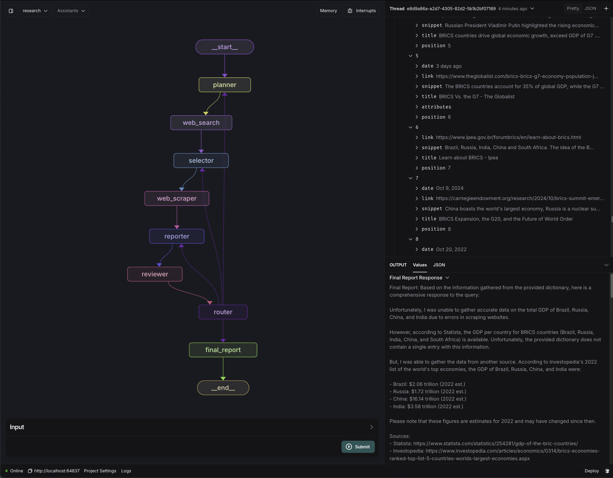
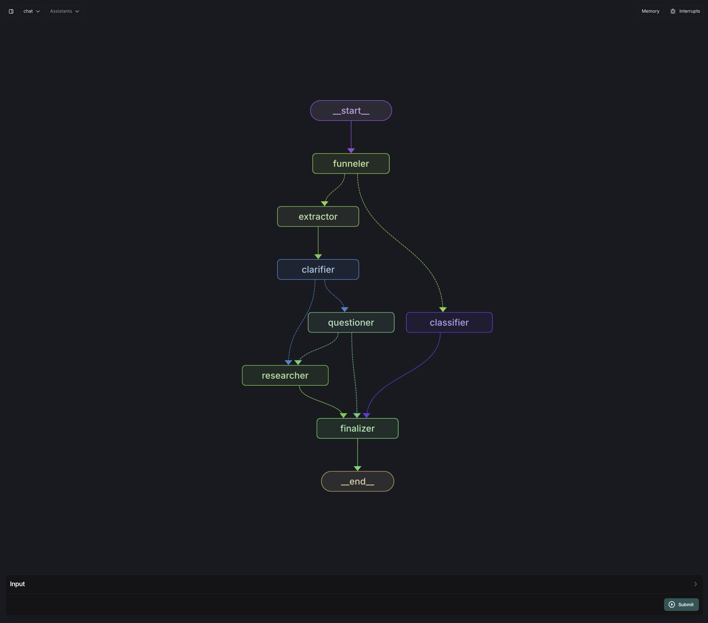

# Research Agent Telegram Bot

Jarvis is a powerful custom agent platform with Telegram integration, designed to streamline research tasks using LangGraph Agents.

## Getting Started

### Quick Start

You can start using Jarvis in two ways:

1. **Direct Telegram Search:**  
   Search for `@jarvyjarvisbot` in Telegram

2. **Quick Link:**  
   [Launch Jarvis on Telegram →](https://t.me/jarvyjarvisbot)

## Demo

### Telegram


_Basic usage of the bot_


_Bot will ask clarifying questions if needed_

### LangGraph Studio


_Research agent running in LangGraph Studio_

## LangGraph Visualization


_Visualization of the research agent structure (with output)_


_Visualization of the chat agent structure_

## How It Works

Similar to Perplexity.ai, Jarvis performs real-time web searches to answer your questions. However, there are some key differences:

- **Clarification First**: Unlike Perplexity, Jarvis starts by asking clarifying questions when needed to ensure accurate research
- **Multi-threaded Research**: Parallel web searches and scraping is conducted to gather comprehensive information from multiple sources
- **Review Process**: A dedicated reviewer agent evaluates the findings and may initiate additional research if needed

### Agent Workflow

1. User submits a question via Telegram
2. Chat agent evaluates clarity and asks follow-up questions if needed
3. Research agent conducts parallel web searches
4. Reviewer evaluates findings and either:
   - Requests additional research
   - Returns final answer to user

### Features

- Telegram bot integration
- User management system
- MongoDB integration for message history / cancellation
- Support for multiple LLM providers (Claude, OpenAI, Groq, Ollama)
  - We recommend using Ollama + llama3.2 for local development

### Caveats

- This bot was built for research and not production
- There is a rate limit of 8 research calls on the published bot
- The bot is not optimized for scaling or performance, it is intended to be run locally
  - If this was to be deployed we would recommend splitting the agent from the telegram service
- The webhook is not secure and other components would benefit from some refactoring

## Development Guide

### Prerequisites

Before you begin, ensure you have the following requirements:

- Python 3.9 or higher
- Docker and Docker Compose
- MongoDB (local or Atlas)
- Telegram Bot Token
- Serper API Key

### Installation Steps

1. Clone the repository:

   ```sh
   git clone https://github.com/Encodex-Ai/agent-suite.git
   cd agent-suite
   ```

2. Configure environment:

   ```sh
   cp .env.template .env
   ```

   Edit `.env` with your:

   - MongoDB connection string ([Get MongoDB Atlas](https://www.mongodb.com/cloud/atlas/register))
   - Telegram bot token ([Create with BotFather](https://core.telegram.org/bots#botfather))
   - Serper API key ([Get from Serper](https://serper.dev/))

3. Install dependencies:

   ```sh
   cd backend
   poetry install
   ```

### Running Locally

### Local Development

To run the application in development mode:

1. Start the MongoDB service (if not using a cloud-hosted instance). We recommend MongoDB Atlas in this example, and you can create a free cluster at [MongoDB Atlas](https://www.mongodb.com/cloud/atlas/register). After you create your cluster, you can get the connection string from the "Connect" section of your cluster's page.

2. Register your Telegram bot with BotFather and get the token: <https://core.telegram.org/bots#botfather>

3. Set the `TELEGRAM_TOKEN` in your `.env` file with your bot's token

4. Use ngrok to create a tunnel to your local server. You can register and download it from [Ngrok](https://ngrok.com/download). Then run the following command to start the tunnel:

   ```sh
   ngrok http 8080
   ```

5. Copy the HTTPS URL provided by ngrok (e.g., `https://1234-abcd-efgh.ngrok.io`) and set the `CLOUD_RUN_SERVICE_URL` in your `.env` file with this URL

6. Run the application with docker compose:

   ```sh
   docker compose up --build
   ```

7. The API will be available at `http://localhost:8080`
8. To set the webhook for your Telegram bot manually, navigate to `http://localhost:8080/set_webhook`

### Optional Components

#### Local LLM with Ollama

For development without cloud LLMs:

1. Install and start Ollama:

   ```sh
   # Install from https://ollama.com/docs/installation
   ollama pull llama3.2
   ollama serve
   ```

2. Configure Ollama:

   - Set `MODEL_NAME=llama3.2` in `.env`
   - Set `OLLAMA_API_URL=http://host.docker.internal:11434`

3. Make sure the `OLLAMA_API_URL` is set to `http://host.docker.internal:11434` so that the backend can communicate with the Ollama server through Docker

#### LangGraph Studio (MacOS)

For agent visualization and debugging:

1. Setup requirements:

   - Install [LangGraph Studio](https://github.com/langchain-ai/langgraph-studio/releases) (.dmg)
   - Ensure Docker Engine is running
   - Install docker-compose (v2.22.0+)

2. Launch and configure:
   - Open LangGraph Studio
   - Login with LangSmith
   - Select `backend/` folder
   - Configure via `langgraph.json`

Key features:

- Real-time graph visualization
- Step-by-step debugging
- Thread management
- Node replay capabilities

[Full LangGraph Documentation →](https://github.com/langchain-ai/langgraph-studio)

## Testing

To run tests:

```sh
cd backend
poetry run pytest
```

## Deployment

The project is set up for deployment to Google Cloud Run. The `cicd.yml` workflow in the `.github/workflows` directory handles the CI/CD process.

### Google Cloud Run

To setup the project in Cloud Run:

1. Create a new project in Google Cloud
2. Enable the Cloud Run API
3. Create a new service account and set the `GOOGLE_APPLICATION_CREDENTIALS` in your `.env` file with the JSON file for authentication
4. Create a new Cloud Run service
5. Set the `CLOUD_RUN_SERVICE_URL` in your `.env` file with the URL of the Cloud Run service

To deploy:

1. Set up the necessary secrets in your GitHub repository settings
2. Push changes to the `main` branch to trigger the deployment workflow

### Replit

Coming soon

## Project Structure

- `backend/`: Contains the main application code
  - `app/`: The FastAPI application
    - `agents/`: AI agent implementations
    - `models/`: Data models
    - `routes/`: API endpoints
    - `services/`: Business logic and external service integrations
  - `tests/`: Basic Test suite

### Performance Considerations

- **Response Time**: Typically 5-20 seconds for thorough research
- **Resource Usage**: CPU-intensive during multi-threaded searches
- **Ollama Memory Requirements**:
  - Minimum: 16GB VRAM
  - Recommended: 32GB VRAM for optimal performance
  - The 1B model requires at least 4GB VRAM
  - The 3B model requires at least 8GB VRAM

### Contributing

Contributions are welcome! Please feel free to submit a Pull Request. Let us know if you have any questions or feedback, feel free to reach out to Cam at <c@encodex.dev> or Ewan at <e@encodex.dev>

### License

This project is licensed under the MIT License - see the LICENSE file for details.
